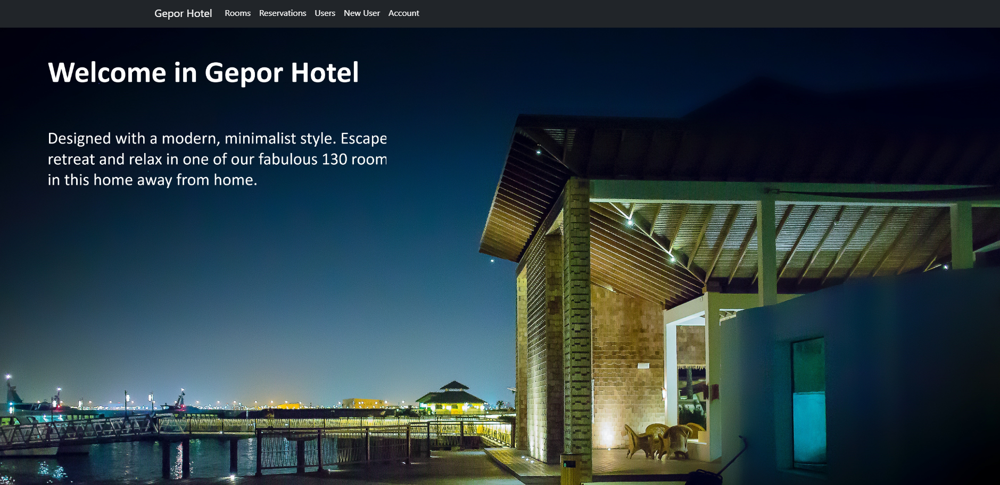
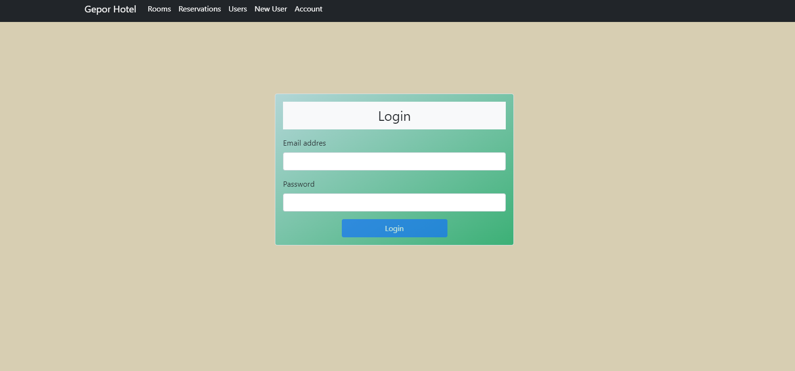
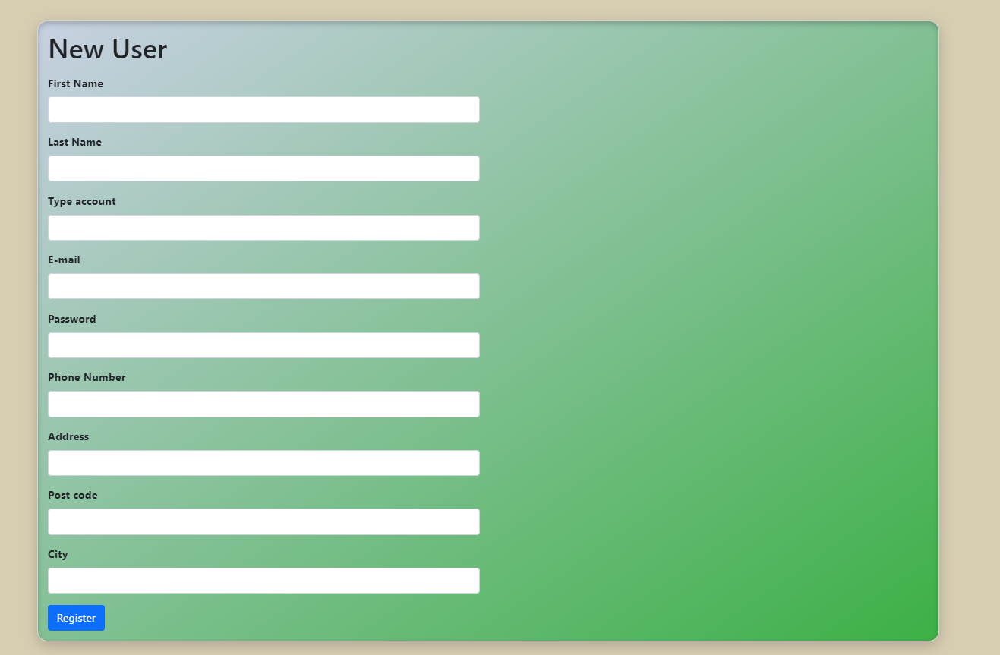
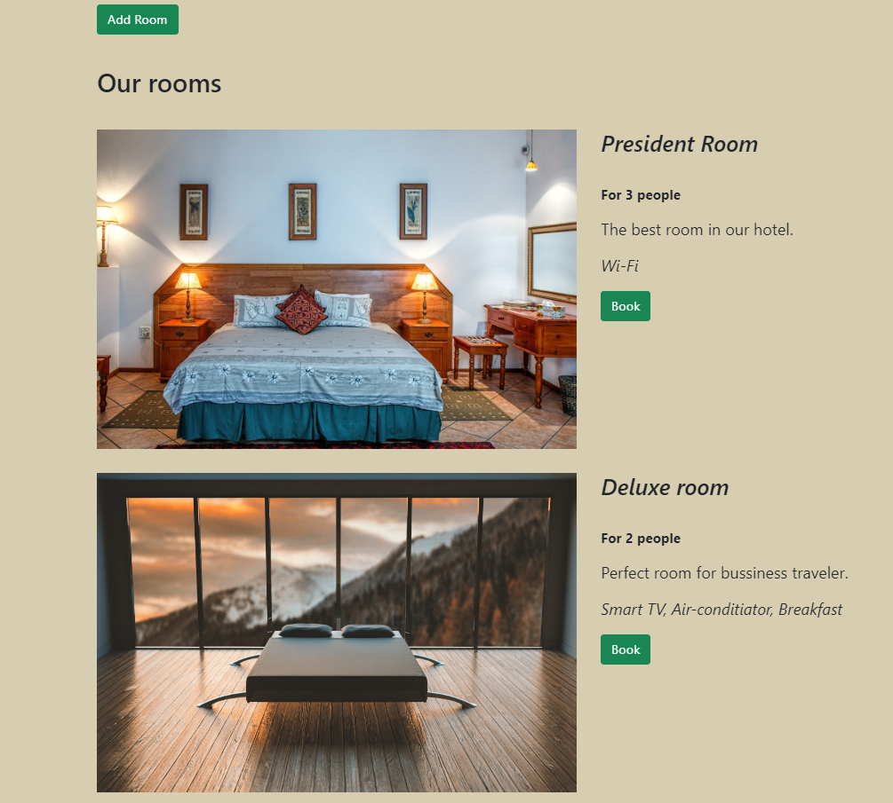

# Hotel system web application
> Web application to add rooms and reservations. User can book and manage your reservations.

## Table of contents
* [General info](#general-info)
* [Technologies](#technologies)
* [Features](#features)
* [Status](#status)
* [Sreenshots](#screenshots)

## General info
Application to manage your hotel.
That one is built in Clean Architecture and CQRS pattern.

## Technologies
* .NET Core 5.0
* WEB API
* ASP.NET, HTML5, CSS3, TypeScript, MSSQL
* Angular
* Depedency Injection
* Entity Framework Core
* LINQ
* Fluent Validation
* AutoMapper
* XUnit
* MediatR
* Bootstrap

## Features
* Rooms managment - CRUD operations
* Reservations managment - CRUD operations
* Viewing and managment rooms/reservations/users lists with DataTables

## Screenshots
### Main page

### Login page

### Register

### List of rooms

## Status
Project is finish.
